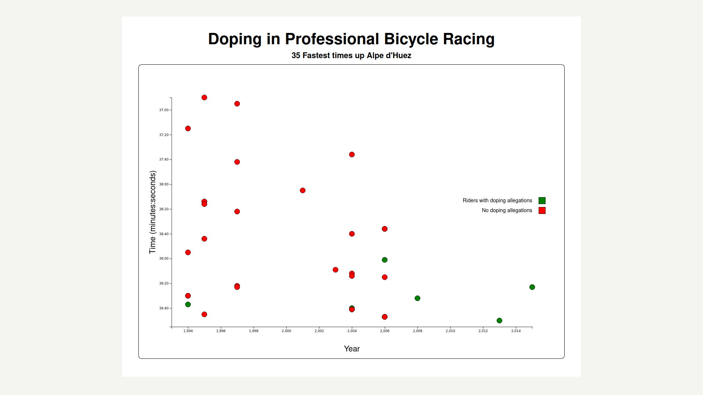

<a name="readme-top"></a>

<div align="right">

  
  <br/>

</div>

<div align="center">

  
  <br/>

</div>

<!-- TABLE OF CONTENTS -->

# 📗 Table of Contents

- [📖 About the Project](#about-project)
  - [🛠 Built With](#built-with)
    - [Tech Stack](#tech-stack)
    - [Key Features](#key-features)
  - [🚀 Live Demo](#live-demo)
- [💻 Getting Started](#getting-started)
  - [Prerequisites](#prerequisites)
  - [Setup](#setup)
  - [Install](#install)
  - [Usage](#usage)
  - [Run tests](#run-tests)
  - [Deployment](#deployment)
- [👥 Authors](#authors)
- [🔭 Future Features](#future-features)
- [🤝 Contributing](#contributing)
- [⭐️ Show your support](#support)
- [🙏 Acknowledgements](#acknowledgements)
- [❓ FAQ (OPTIONAL)](#faq)
- [📝 License](#license)

<!-- PROJECT DESCRIPTION -->

# 📖 [DOPING CYCLING DATA] <a name="about-project"></a>

**[DOPING CYCLING DATA]**  aims to create an app that replicates the functionality of a scatterplot graph. The app is built using HTML, JavaScript, CSS, and the D3 SVG-based visualization library. It fulfills a set of user stories that include displaying a title, x-axis, and y-axis with corresponding IDs, rendering dots to represent data points, associating data values with the dots using data-xvalue and data-yvalue properties, aligning the dots with the corresponding points on the axes, displaying tick labels on the y-axis in the format of %M:%S time, displaying tick labels on the x-axis representing years, ensuring the range of x-axis and y-axis labels matches the actual data range, including a legend with descriptive text, showing tooltips with additional information when hovering over areas, and ensuring the tooltip includes a data-year property corresponding to the data-xvalue of the active area. By fulfilling these user stories, the app will pass the provided tests.

## 🛠 Built With <a name="built-with"></a>

### Tech Stack <a name="tech-stack"></a>

> Describe the tech stack and include only the relevant sections that apply to your project.

<details>
  <summary>Client</summary>
  <ul>
    <li><a href="https://reactjs.org/">JavaScript</a></li>
  </ul>
</details>

<details>
  <summary>Client</summary>
  <ul>
    <li><a href="https://reactjs.org/">JavaScript</a></li>
  </ul>
</details>

<!-- Features -->

### Key Features <a name="key-features"></a>

> Describe between 1-3 key features of the application.

- **[Interactive Data Visualization:]** The app allows users to explore and analyze data through an interactive scatterplot graph. Users can hover over data points to view tooltips with additional information, providing a more detailed understanding of the plotted data.

- **[Axis and Label Customization:]** The app generates and displays axes (x-axis and y-axis) with corresponding tick labels. The x-axis represents years, while the y-axis displays time values in the format of %M:%S. This feature provides a clear visual representation of the data and helps users interpret the plotted values accurately.

- **[Data Accuracy and Validation:]]** The app ensures that the data values associated with each dot (data-xvalue and data-yvalue) are within the range of the actual data and in the correct format. This validation ensures the accuracy of the visualization and prevents any potential data discrepancies. Additionally, the x-axis and y-axis labels are dynamically generated based on the actual data range, further enhancing the reliability of the displayed information.

<p align="right">(<a href="#readme-top">back to top</a>)</p>

<!-- LIVE DEMO -->

## 🚀 Live Demo <a name="live-demo"></a>

> Add a link to your deployed project.

- [Live Demo Link](https://google.com)

<p align="right">(<a href="#readme-top">back to top</a>)</p>

<!-- GETTING STARTED -->

## 💻 Getting Started <a name="getting-started"></a>

> Describe how a new developer could make use of your project.

To get a local copy up and running, follow these steps.

### Setup

Clone this repository to your desired folder:

<!--
Example commands:

```sh
  cd my-folder
  git clone https://github.com/carreraprogrammer/Doping-data.git
```
--->

<p align="right">(<a href="#readme-top">back to top</a>)</p>

<!-- AUTHORS -->

## 👥 Authors <a name="authors"></a>

👤 **Daniel Carrera**
​
- GitHub: [@carreraprogrammer](https://github.com/carreraprogrammer)
- Twitter: [@carreraprogrammer](https://twitter.com/carreraprog)
- LinkedIn: [Daniel Carrera] (https://www.linkedin.com/in/daniel-carrera-paz-85a917244/)

<p align="right">(<a href="#readme-top">back to top</a>)</p>

<!-- CONTRIBUTING -->

## 🤝 Contributing <a name="contributing"></a>

Contributions, issues, and feature requests are welcome!

Feel free to check the [issues page](../../issues/).

<p align="right">(<a href="#readme-top">back to top</a>)</p>

<!-- SUPPORT -->

## ⭐️ Show your support <a name="support"></a>

> Write a message to encourage readers to support your project

If you like this project...

<p align="right">(<a href="#readme-top">back to top</a>)</p>

<!-- ACKNOWLEDGEMENTS -->

## 🙏 Acknowledgments <a name="acknowledgements"></a>

> Give credit to everyone who inspired your codebase.

I would like to thank my academy, my family and Freecodecamp to help me to be my best version

<p align="right">(<a href="#readme-top">back to top</a>)</p>

<!-- LICENSE -->

## 📝 License <a name="license"></a>

This project is [MIT](./LICENSE) licensed.

_NOTE: we recommend using the [MIT license](https://choosealicense.com/licenses/mit/) - you can set it up quickly by [using templates available on GitHub](https://docs.github.com/en/communities/setting-up-your-project-for-healthy-contributions/adding-a-license-to-a-repository). You can also use [any other license](https://choosealicense.com/licenses/) if you wish._

<p align="right">(<a href="#readme-top">back to top</a>)</p>
